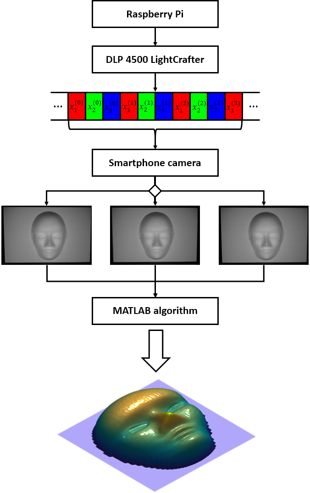

# 3D DLP Scanner System

With **3D DLP high-speed scanner system** it is possible to retrieve the 3D shape of an object applying **DFP** (Digital Fringe Projection) techniques, using a **DLP LightCrafter 4500 Projector** controlled by a **Raspberry Pi**.

In a simple way, the system works as follows:

<p align="center">
  
</p>

The whole process is explained at **[this document](Project.pdf)**.

## Instruction Manual
If you just want to **test the system** you only need last MATLAB version to date (tested with R2016b). Download **[MATLAB script](matlab)** and run **algorithm.m** which will display a 3D object representation as example.

If you want to **build the whole system** you will need next components:
* **[Raspberry Pi 3 Model B](https://www.raspberrypi.org/products/raspberry-pi-3-model-b/)** with last version of **[Raspbian Jessie lite](https://www.raspberrypi.org/downloads/raspbian/)** or similar installed.
* **[DLP LightCrafter 4500](http://www.ti.com/tool/dlplcr4500evm)**.
* **MATLAB R2016b** version or higher.
* Any camera, e.g. the **smartphone camera**.

And **the steps** to set up the system are following:

1. Connect everything as specified on page 5 of **[technical project documentation](Project.pdf)**.
2. Change **RPi HDMI resolution** to projector resolution 912x1140 editing **/boot/config.txt** file:
```
hdmi_group=2
hdmi_mode=87
hdmi_cvt=912 1140 60 4 0 0 0
```
3. Install **[HIDAPI Library](rpi/hidapi)** on RPi:
```bash
sudo apt-get install libusb-1.0-0-dev
cd ~/hidapi
make
sudo make install 
sudo ldconfig
```
4. Install **[Texas Instruments DLP SDK](rpi/sdk)** on RPi:
```bash
cd ~/sdk
make
sudo make install 
sudo ldconfig
```
5. Install and run **[pGenerator app](rpi/pGenerator)** on RPi to project moving fringe patterns:
```bash
cd ~/pGenerator
make
# HELP OPTION
./pGenerator -h
# HIGH-SPEED MODE with 220 fringe intensity, 10 pixel period and 100ms per frame.
sudo ./pGenerator -s -I 220 -T 10 -t 100000
```
6. Record **calibration plane and object sequence** with the camera.
7. Copy both videos to **[MATLAB script](matlab)** folder.
8. Finally... run **algorithm.m**
